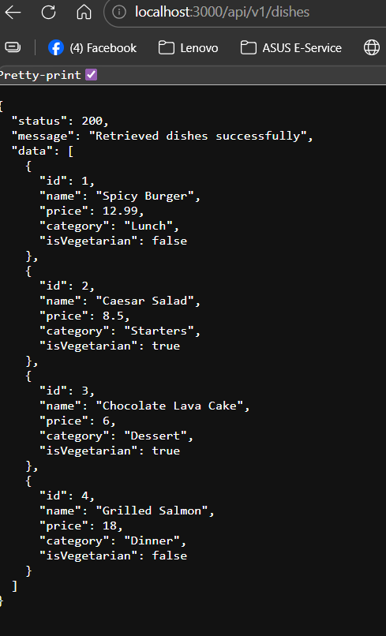
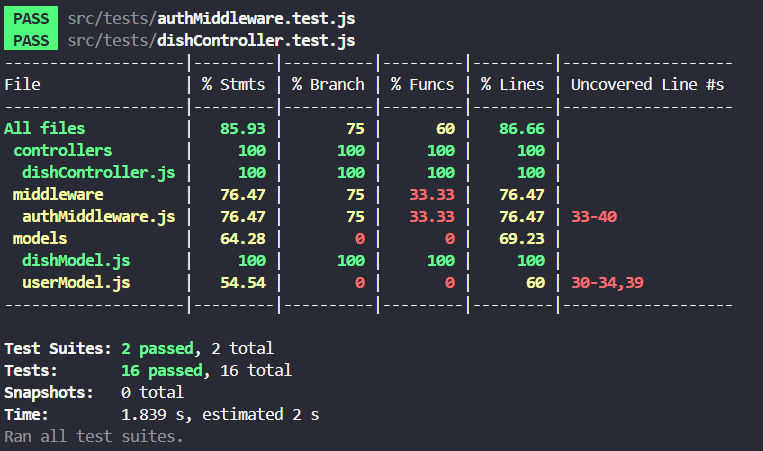
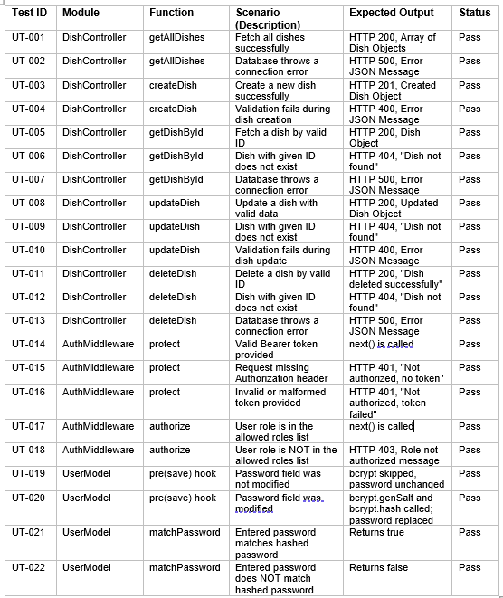

# RESTful API Activity - Alleiyah Gonzaga

## Best Practices Implementation

### 1. Environment Variables
**Question:** Why did we put `BASE_URI` in `.env` instead of hardcoding it?

**Answer:** We use `.env` files for **security** and **scalability**. Hardcoding URIs makes the application rigid and exposes sensitive configuration details if the code is pushed to public repositories like GitHub. By using environment variables, we can easily switch between different environments (e.g., local development, staging, or production) without modifying the actual source code.

---

### 2. Resource Modeling
**Question:** Why did we use plural nouns (e.g., `/dishes`) for our routes?

**Answer:** In REST API design, endpoints represent **collections** of resources. Using plural nouns is the industry standard because it clearly indicates that the endpoint deals with a group of items. For example, `/dishes` represents the entire collection, while `/dishes/:id` points to a specific individual resource within that collection. This makes the API intuitive and easy for other developers to navigate.

---

### 3. Status Codes
**Question:** When do we use `201 Created` vs `200 OK`? Why is it important to return `404` instead of just an empty array or a generic error?

**Answer:**
* **201 Created vs 200 OK:** We use `201 Created` specifically after a successful `POST` request that results in the creation of a new resource. `200 OK` is used for successful `GET`, `PUT`, or `PATCH` requests where an action was performed successfully but no new resource was originated.
* **Importance of 404:** Returning a `404 Not Found` status is crucial for accurate debugging and client-side logic. It explicitly tells the client that the specific resource (ID) they requested does not exist. Returning a generic error is vague, and returning an empty array for a specific ID search is semantically incorrect, as an ID lookup should return a single object or nothing at all.

---

### 4. Testing
**Screenshot of a successful GET request:**

! 

---------------------------------------

## Why did I choose to Embed the Review?

I chose to embed the Review because reviews are directly related to a
specific dish and are usually displayed together with it. By embedding
the reviews inside the Dish document, I can retrieve all the necessary
information in a single query, which improves speed and performance. It
also ensures atomicity, meaning the Dish and its Reviews are saved at
the same time, keeping the data consistent. Since reviews typically
belong only to one dish and are not reused elsewhere, embedding is more
practical and efficient.

## Why did I choose to Reference the Chef?

I chose to reference the Chef because a chef can be associated with
multiple dishes, and their information may change over time. By using
referencing, the Chef's data is stored in a separate document and linked
through an ID. This makes updates more efficient because if the Chef
changes their name or other details, I only need to update it in one
place instead of modifying every dish document. Referencing also helps
manage document size, especially since MongoDB has a 16MB limit per
document, preventing the Dish document from becoming too large.

# Securing API
QUESTIONS

1. What is the difference between Authentication and Authorization in our code?
- **Authentication**: Verifies who the user is. In our code, this happens when a user logs in with an email and password — the system checks if the credentials match an existing account.  
- **Authorization**: Verifies what an authenticated user is allowed to do. In our code, this controls access to certain routes based on the user’s role (e.g., admin vs regular user).  

2. Why did we use bcryptjs instead of saving passwords as plain text in MongoDB?
- We use **bcryptjs** to hash passwords instead of saving them as plain text in MongoDB.  
- Hashing makes passwords unreadable in the database. Even if someone gains access to the database, they cannot see actual passwords. Salting adds extra security against brute-force attacks.  

3. What does the protect middleware do when it receives a JWT from the client?
- The **protect middleware** checks the JWT sent by the client in the request headers.  
- It verifies that the token is valid and not expired, then extracts the user information encoded in the token.  
- This allows the system to confirm the user’s identity and grant access to protected routes.  

# ACTIVITY 5 - The Testing Triangle - Comprehensive Unit Testing & Documentation

# Jest Coverage Table

---

# Formal Unit Test Documentation Table

---
---

Here are the same answers, rewritten to sound like a real student wrote them:

---

## Essay Questions

**1. Mocking**

> **Explain in your own words why we mocked Dish.find and jwt.verify. What specific problem does mocking solve in Unit Testing??**

We mocked them because we don't actually want to connect to a real database or deal with real tokens during testing. If `Dish.find` ran for real, it would need a live MongoDB connection and if that connection is down or the collection is empty, the test fails even if our controller code is perfectly fine. That's not fair to test. Mocking fixes that by letting us say "just pretend this returned some data" so we can focus on what our function actually does with that data. Same idea with `jwt.verify` we're not testing whether JWT works, we're testing whether our middleware reacts correctly to a valid or invalid token. So we just fake the output and check our logic from there.

---

**2. Code Coverage**

> **Look at your Jest Coverage report. Explain what % Branch coverage means. If yourBranch coverage is at 50%, what does that tell you about your tests? (Hint: Think about if/else statements).**

Branch coverage tracks whether your tests went through both sides of every `if/else` in your code. Like if you have `if (dish)` that returns a 200, but you never tested what happens when dish is `null`, that else path is uncovered meaning branch coverage goes down. At 50%, it basically means you're only testing the happy path. Your tests probably cover what happens when things go right, but not what happens when they go wrong. That's dangerous because bugs usually hide in those edge cases and error conditions that nobody tested.

---

**3. Testing Middleware**

> **In our authMiddleware.test.js, why did we use jest.fn() for the next variable, and why did we assert expect(next).not.toHaveBeenCalled() in the failure scenario??**

There's no real Express server running during unit tests, so `next` doesn't exist — we have to make a fake one using `jest.fn()`. It doesn't actually do anything, but it lets us track whether it got called or not. The reason we check `expect(next).not.toHaveBeenCalled()` in the failure cases is because calling `next()` means "let the request through." If our middleware calls it even when the token is missing or wrong, that's a serious bug — it means unauthorized users could get into protected routes. So we assert it wasn't called to make sure our middleware actually blocked the request like it was supposed to.

# ACTIVITY 6: The Testing Triangle - Integration Testing

**1. Unit vs. Integration**

>**Explain the difference between the Unit Test you wrote in Activity 5 and the Integration Test you wrote today. What does the Integration Test check that the Unit Test does not?**

Unit Testing (Activity 5) tests a single function (the controller) in complete isolation, the database is `mocked`, so it never actually reads or writes real data. Integration Testing checks that the `Router → Controller → Model → Database` all work together correctly as a system. The Integration Test verifies that data is actually saved in the database, which a Unit Test cannot confirm.

**2. In-Memory Databases**

>**Why did we install mongodb-memory-server instead of just connecting our tests to our real MongoDB Atlas URI? Mention at least two reasons.**

We use mongodb-memory-server instead of our real Atlas URI for two reasons: (1) Safety — tests create and delete fake data constantly; connecting to Atlas would pollute or corrupt real production data. (2) Speed & Isolation — a RAM database is much faster than a network connection to Atlas, and each test run starts with a clean slate, making tests reliable and independent.

**3. Supertest**

>**What is the role of supertest in our test file? Why didn't we use Postman for this?**

supertest acts as a fake HTTP client that sends real GET/POST/etc. requests directly to our Express app without needing the server to actually be running on a port. We don't use Postman because Postman is manual; supertest lets us automate and repeat these HTTP checks every time we run npm test, making it part of our CI/CD workflow.